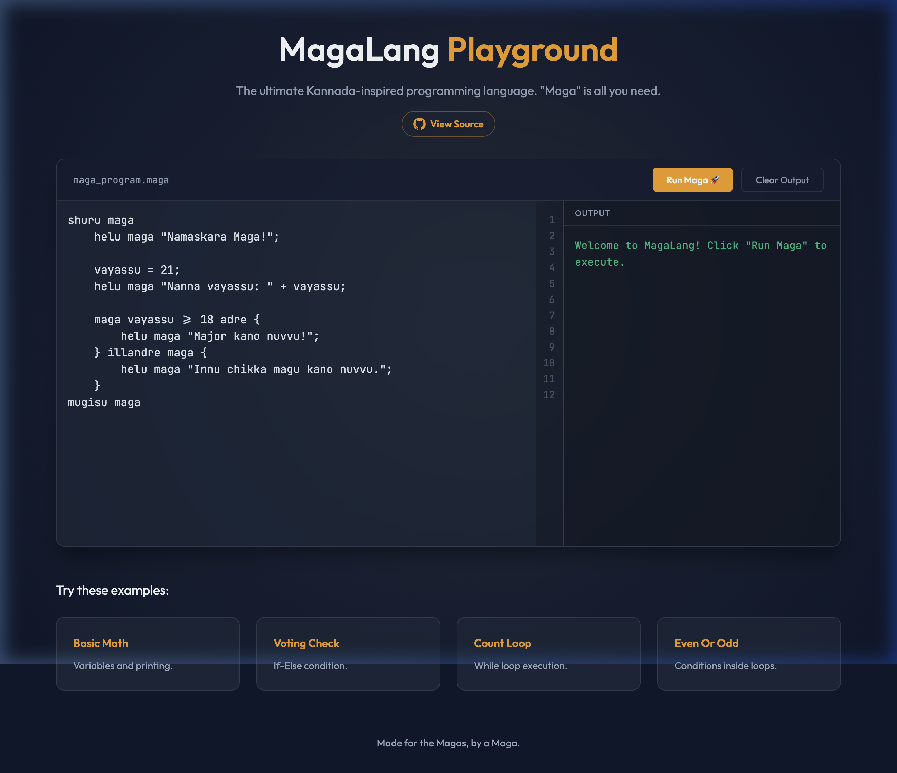

# MagaLang

Repo: magalang

A toy programming language with Kannada keywords, and a browser playground for writing and running it. For people learning to code who would rather read `helu maga` than `print` — *maga* is Kannada slang for "mate" or "dude".

[Live playground](https://nvkudva.github.io/magalang/)



## Requirements

- A modern browser. That is the whole toolchain — no Node, no build step, no package manifest.
- Optional: a network connection. The editor's Kannada typing suggestions call `inputtools.google.com`, and the page loads the Noto Sans Kannada webfont from Google Fonts. Without the network the editor still runs English-keyword programs.

## Run it

```bash
git clone https://github.com/nvkudva/magalang.git
cd magalang
open index.html          # or: python3 -m http.server 8000
```

You should see the playground with a program already in the editor; pressing Run prints to the output pane.

## Language reference

Every program starts with `shuru maga` and ends with `mugisu maga`.

| Keyword | Meaning |
|---|---|
| `shuru maga` | Program start |
| `mugisu maga` | Program end |
| `helu maga` | Print to output |
| `maga` | If / start of an expression |
| `adre` | Then |
| `illandre maga` | Else / else-if |
| `repeat madu maga` | While loop |

```maga
shuru maga
    vayasu = 18;
    maga vayasu >= 18 adre {
        helu maga "Vote hakabahudu maga!";
    } illandre maga {
        helu maga "Kaayi maga!";
    }
mugisu maga
```

```maga
shuru maga
    i = 1;
    repeat madu maga i <= 5 {
        helu maga "Count: " + i;
        i = i + 1;
    }
mugisu maga
```

## How it works

Four files load as plain globals from `index.html`, with hand-bumped `?v=` cache-busting on each script tag.

- `maga-interpreter.js` — the `MagaInterpreter` class. `interpret()` rewrites Kannada keywords to their English forms, tokenizes into a flat string array, then walks that array by index dispatching on print, assignment, if/else and while. Expressions are handed to JavaScript `eval` after variables are substituted into the source text.
- `kannada-transliteration.js` — the `KannadaTranslit` global: a romanized-to-Kannada syllable table plus the `KANNADA_KEYWORDS` map the interpreter normalizes against.
- `app.js` — all the UI: editor caret handling, the English/Kannada mode toggle, the Google Input Tools suggestion client, and the Run button.
- `index.html` — carries the four example programs as `data-code-en` and `data-code-kn` attributes. The Kannada versions are hand-written, so they can drift from what the transliterator emits.

## Status

The playground works: the four example programs run, and the four statement forms above behave as documented. Everything below is known-broken as of 7 September 2026 and unfixed.

- **Expressions run through `eval`.** MagaLang code can execute arbitrary JavaScript in the page. Only your own keyboard reaches it today, so this is self-XSS on a static site — but do not add a share link or URL-fragment loader before this is replaced.
- **Errors print as if they were values.** An undefined variable or a syntax error returns the raw source text instead of raising. `helu maga zzz + 1;` prints `zzz + 1`. This is the worst defect here for a beginner.
- **No float literals.** The tokenizer has no `.` rule, so `3.5 + 1` prints `3 5 + 1`.
- **No comment syntax.** A line starting with `//` is not skipped — `// a = 99;` assigns 99.
- **Infinite loops freeze the tab.** `repeat madu maga` has no iteration cap and runs on the main thread. A missing `;` also grows an unbounded token scan until the engine throws.
- **The offline transliteration fallback emits unrunnable code.** `transliterateWord` produces different glyphs from the ones `KANNADA_KEYWORDS` accepts, so if the Google request fails the suggestions will not run.
- **No tests, no linter, no CI.** Zero automated coverage of any of the above.

`REVIEW.md` in this repo has the file-and-line detail and a prioritized fix list.

## License

No licence file yet — all rights reserved.
